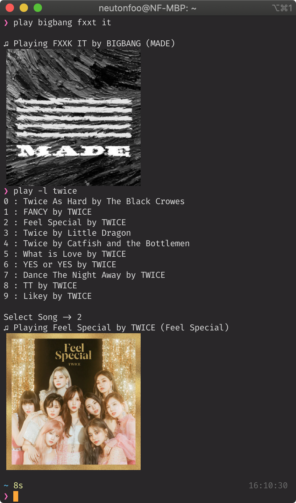
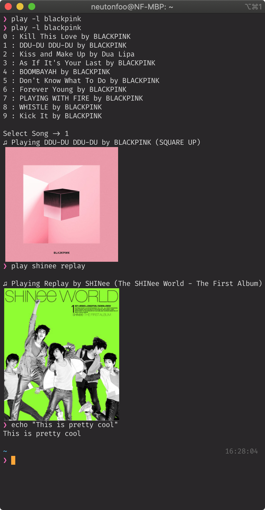

# Go-SpotifyCLI

I made this for fun and to practice using Go. It isn't meant for serious use. Album Art is shown through imgcat and will only work with iTerm2.

## Dependencies

Install dependencies with `go get -d ./`

## Install Instruction

A Spotify application has to be created on the Spotify Developers website. Export the client id and client key as environmental variables (or paste them into the `clientID` and `secretKey` respective if you are building a binary).

Additionally, the redirect URL

## Usage

You must first generate a JSON containing the oAuth token (saved into home directly by default) by using the `-login` flag. Similarly, use this flag to force generate a new oAuth token should the refresh token expire. This will start a web server on port 8080 to receive the oAuth callback.

`go run play.go -login`

Then run `go run play.go search query`. This will perform a track search via the Spotify API with the query `search query` and play the first result.

To, instead, select from a list of returned results use the `-l` flag. It will list the top 10 results and prompt for which one to play.

During testing, I ran into issues where the song would not start due to there being no active speaker. In order to set the active player, use the `-p` flag. Selection of the player will be similar to the `-l` flag.

## Screenshots

I used `go build` to generate a binary (named `play`) and placed it in my `~/bin` folder. If you want to do this, don't forget to add `$HOME/bin` into your path as it's not included on macOS by default. You may also need to hardcode your client id and secret key.

 

